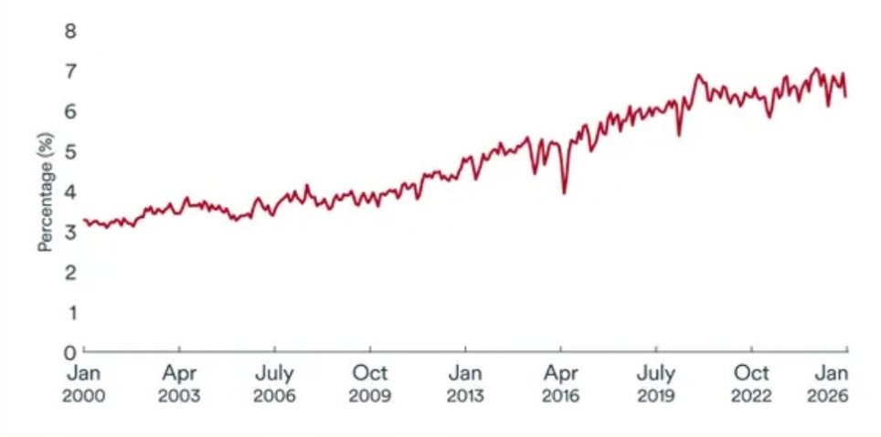

# Canada's Economy at a Glance

In their March 18th announcement, the Bank of Canada kept a cautious stance as Canada’s economy balances slowing economic growth, with rising
inflationary pressures impacted by rising oil prices. Geopolitical tensions involving Iran have caused nearly a 40% increase in oil prices, putting an upward pressure on inflation. Unlike many economies, Canada is partially benefitting from higher oil prices, as the energy sector represents nearly 10% of GDP, boosting revenues in oil producing regions like Alberta. With ongoing uncertainty related to oil price volatility, trade negotiations (CUSMA), and slowing population growth (restrictive immigration policies), economists are predicting that the BOC will maintain a hold on interest rates at 2.25% for their next announcement, scheduled for April 29th.

- *CPI and inflation data for March 2026 will release on April 20th*

- *The Consumer Price Index (CPI) represents the changes in prices that
Canadian consumers face, across a basket of goods and services.
Source: TD Economics and Statistics Canada*

# Share of global production of crude oil, Canada

*Source:* Natural Resources Canada, EIA, BDC

Canada's rising share of global crude oil production has reduced its vulnerability to oil price shocks.

# Author's Commentary

The Bank of Canada’s cautious approach shows how uncertain the current economic environment has become. While inflation had been easing, rising oil prices impacted by geopolitical tensions in Iran demonstrate how
quickly global events can shift the view. Canada is in an interesting position from these rising oil prices. While it pushes up costs for consumers, it also supports economic activity in Canada’s energy producing regions. This makes it difficult for policymakers when deciding to cut or hold interest rates. While government and consumer spending are expected to be the main drivers of GDP growth in 2026, ongoing trade uncertainty and global risks continue to hold back stronger
growth and investment. Looking ahead, policymakers should place greater emphasis on diversifying trade relationships or strengthening domestic industries such as energy, minerals and manufacturing. This can help reduce Canada’s vulnerability to external shocks and improve long term growth.

# Current News

**Middle East Conflict Strains Energy Markets and Inflation**

Conflict in the Middle East has rattled international energy sectors, especially with nearly 20% of global petroleum flowing through the currently obstructed Strait of Hormuz. For the Canadian economy, the strain of rising fuel costs is expected to trim economic expansion by a few tenths in 2026, while pushing headline CPI up. This creates a dilemma for the Bank of Canada, as hiking interest rates to control inflation puts strain on an already weakening domestic economy.

**Canada’s GDP Rebounds, But Slowly**

New Statistics Canada figures show a 0.1% increase in January's real GDP, with a 0.2% forecast for February, indicating Canada is kicking off 2026 with greater momentum than anticipated following a sluggish end in Q4 2025. Nevertheless, sector-specific performance remains uneven. While mining and oil climbed 1.6%, the manufacturing sector fell 1.4%. Most economists predict the Bank of Canada will maintain its 2.25% policy rate during the April 29th announcement, opting for a more cautious stance amidst ongoing global trade volatility and geopolitical tensions.

**Canada’s Housing Market Stays Balanced**

As of February 2026, Canada’s national sales-to-new-listings ratio reached 47.6%, maintaining a relatively balanced market with approximately five months of available inventory. However, the condo sector is weakening, with annual housing starts expected to decline to approximately 243,000 units from roughly 259,000 in 2025. Factors driving this decrease include high development costs, trade instability, and a surplus of unsold units, dampening builder interest. Meanwhile, the gap between expensive markets like Toronto and Vancouver and more affordable sites continues to expand.

# Economics Society News, Events, and Articles

Stay updated by following us on Instagram @uweconsoc for upcoming event information.
