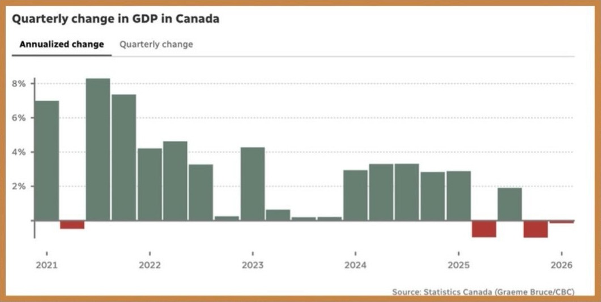

# Gross Domestic Product

Gross Domestic Product (GDP) is one of the most closely watched economic indicators. You've likely heard the term in the news or in an introductory economics course, but why does it receive so much attention?

GDP represents the total value of all finished goods and services produced within a country, over a specific period. Economist Simon Kuznets helped by creating a standard measure for national production, eventually refining it into GDP in 1934. It became a standardized way for policymakers to measure economic performance and track downturns.

Today, economists commonly calculate GDP using the expenditure approach: consumption + investment + government spending + net exports, represented as `C + I + G + (X - M)`

# Change in Canada's GDP

During the end of May 2026, Statistics Canada released Q1 2026 GDP data. The report initially showed another quarter of GDP contraction following Q4 2025, which would meet the definition of a technical **recession** (two consecutive quarters of negative GDP growth).

However, economists took a closer look at the data and noted that Q1 2026 GDP was unchanged compared to Q4 2025, meaning the economy remained relatively flat rather than contracting. As a result, some economists argue that this allows the Canadian economy to escape the definition of a technical recession. Details like these capture why economic conditions are difficult to convey. While GDP remains an important indicator of economic momentum, economists often look at additional factors such as **unemployment, inflation, and consumer spending** to better understand the overall economy.
